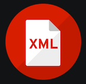

# Lenguaje de marcas UD1

## Definiciones lenguajes de marcas

### Definición

Lenguaje de marcas: Organiza información mediante una sintaxis basada en marcas y etiquetas

### Tipos de lenguajes de marcas

|Tipo|Para qué sirve|Ejemplos|
|----|--------------|--------|
|Presentación|Muestra contenido formateado| HTLM,CSS|
|Descriptivo|Intercambio información|XML,JSON|
|Documentación|Documentar proyectos|MarkDown,Latex|

## Instalación y Configuración del entorno de trabajo
1. Instalar [VS Code](https://code.visualstudio.com)
2. Instalar plugins
   - Instalar [HTML CSS Support](https://marketplace.visualstudio.com/items?itemName=ecmel.vscode-html-css)
   - Instalar [Live Preview](https://marketplace.visualstudio.com/items?itemName=ms-vscode.live-server)
   - Instalar [MarkDown All in one](https://marketplace.visualstudio.com/items?itemName=yzhang.markdown-all-in-one)  
   - Instalar [XML](https://marketplace.visualstudio.com/items?itemName=redhat.vscode-xml)
   
3. instalar git
   ```bash
   sudo apt install git
   ```
4. crear repositorio, añadir código y hacer commit


## Plugins instalados

|Plugin|Imagen|uso|
|------|------|---|
|HTML CSS Support||Aporta ayuda de sintaxis y autocompleción para CSS|
|Live preview| |Previsualizar de código HTML en tiempo real|
|Markdown||Previsualizar de código MarkDown en tiempo real|
|XML||Aporta ayuda de sintaxis y autocompleción para XML|
